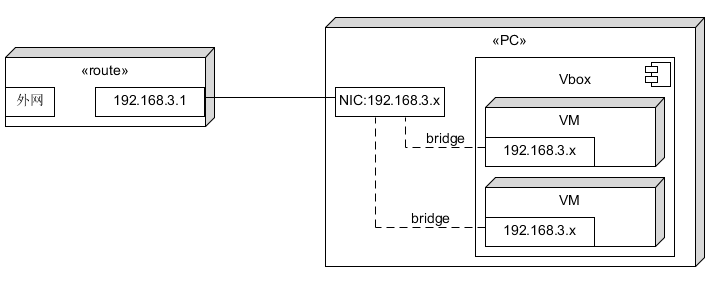
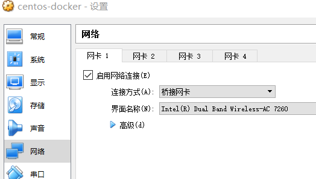
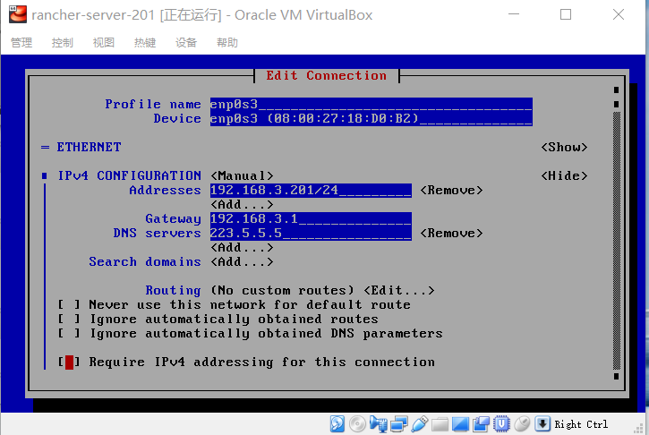

# kerbernetes 容器云实验环境的安装（Rancher）
{:.no_toc}

* 目录
{:toc}

由于众所周知的原因，kerbernetes及其周边产品关系复杂，安装 kerbernetes 反正是一件痛苦的煎熬。幸好国内各大服务商都给出一些一键部署的方案，Rancher 是比较好的开源服务之一。

本文介绍在一台PC或笔记本电脑上使用 VirtualBox 配置多个虚拟机机部署 kerbernetes 集群的方法。部署工具 Rancher 

实验目的：

* 了解容器云基本概念！

## 1、主机（HOST）网络环境

**1.1、如果你有一台路由器：**

由于 windows 非服务器版本不支持 IP Forwarding and Routing，因此你需要一台路由（家用无线路由即可）。有了路由器，主流系统做HOST都可以。配置如图所示：

具体 virtualBox 配置是：

**1.2、如果你省路由，就必须用 Linux 作为主机**

请打开 IP Forwarding，配置好路由，将 VirtualBox 虚拟网转发到外网。如同 docker 的网桥配置一样。

## 2、创建基础虚拟机 centos-docker

1. 虚拟机环境准备
    - 主机安装了 Virtualbox
    - 构建 minimal centos 7 虚拟机
2. 用链接方式，复制已有虚拟机， 取名 centos-docker
    - 检查该虚拟机设置 - 网络，确保只有一块网卡有效
    - 设置网卡 `连接方式` = `桥接网卡`
    - `界面名称` = 你访问外网的网卡
3. 配置虚拟机
    - 启动虚拟机，用 `ip address` 检查网络是否动态获得路由分配的地址
    - 检查网络网桥是否工作正常，如 `ping www.sysu.edu.cn`
    - 升级 centos 以保证 docker 能正常启动。 `yum update`
    - 设虚拟机网络为固定地址（如：192.168.3.200），使用 `nmtui`
        - 将网卡设为手动， 网络地址 `192.168.3.200/24` , 
        - gateway `192.168.3.1` ，即路由的地址
        - DNS `223.5.5.5` 阿里的 DNS
        - 然后， deactivitate, activitate 该网卡
        - 修改 hostname = centos-docker
        - 退出
        - 用 `ip address` 检查设置是否生效!
    - 检查网络，如 `ping www.sysu.edu.cn`
4. 安装 docker 17.03.2 ce
    - 在 host 使用 ssh 连接虚拟机，例如：`ssh root@192.168.3.200` 
    - 按[官网指南](https://docs.docker.com/install/linux/docker-ce/centos/#install-docker-ce)？ 这个[中文指南更详细](http://www.cnblogs.com/freefei/p/9263998.html)。请务必对比官网指南，避免中文落伍给你带来麻烦！
    - 最后，启动 docker 服务并验证
        - `systemctl enable docker`
        - `systemctl start docker`
        - `docker verson`

## 3、下载需要的镜像

预先在 docker 虚拟机下载镜像，避免你因长时间等待失去耐心。

以下镜像仅试用 rancher/rancher:v2.1.3 版本。容器云的东西变化都太快，https://hub.docker.com/r/rancher/rancher/tags 可看到，这是11天前的版本。

* rancher 服务器
    - rancher/rancher:v2.1.3
* rancher 代理
    - rancher/rancher-agent:v2.1.3
    - rancher/rke-tools:v0.1.15
* kerbernetes manager
    - rancher/hyperkube:v1.11.5-rancher1
    - rancher/nginx-ingress-controller:0.16.2-rancher1
    - rancher/calico-node:v3.1.3
    - rancher/calico-cni:v3.1.3
    - rancher/k8s-dns-dnsmasq-nanny-amd64:1.14.10
    - rancher/k8s-dns-kube-dns-amd64:1.14.10
    - rancher/k8s-dns-sidecar-amd64:1.14.10
    - rancher/coreos-etcd:v3.2.18
    - rancher/coreos-flannel:v0.10.0
    - rancher/pause-amd64:3.1  
    - rancher/metrics-server-amd64:v0.2.1
    - rancher/nginx-ingress-controller-defaultbackend:1.4
    - rancher/cluster-proportional-autoscaler-amd64:1.0.0 
* kerbernetes worker
    - rancher/hyperkube:v1.11.5-rancher1
    - rancher/nginx-ingress-controller:0.16.2-rancher1
    - rancher/calico-node:v3.1.3
    - rancher/calico-cni:v3.1.3
    - rancher/coreos-flannel:v0.10.0
    - rancher/pause-amd64:3.1  

得益于 go 语言及其静态编译技术，现在系统的许多镜像都建立在 scrach 或 alpine 之上，非常的小哦！！！

## 4、安装 kubernetes 快体验 

1. 准备环境（在前面 centos docker 基础上）
    - 准备 rancher-server-201。 ip = 192.168.3.201, 主机名 rancher-server-201
    - 准备 k8s-manager-210。 ip = 192.168.3.210, 主机名 k8s-manager-210
    - 准备 k8s-worker-220。 ip = 192.168.3.220, 主机名 k8s-worker-220
    - 配置虚拟机网络，建议使用 nmtui，如图：
        - 
2. 安装 rancher 服务器
    - `docker run -d --restart=unless-stopped -p 80:80 -p 443:443 rancher/rancher:v2.1.3`
    - 在主机浏览器下访问 `https://192.168.3.201` 出现 lancher 的控制面板
3. 安装 k8s 管理节点
    - 在 rancher dashboard 下，Global - Clusters 下  Add Cluster
    - **选 Custom 图标**
    - 输入你喜欢的 Cluster Name
    - 按 next 按钮
    - Node Role **全部选择 Etcd、control Panne、Worker**
    - 拷贝系统给出的命令
    - **在 k8s-manager-210 上执行该命令**
    - 看到 `new node has regostered`
    - 按 done 按钮
    - 耐心等待一会系统容器启动，State 变为 Active ！
4. 安装 k8s 工作节点
    - 点击你的 cluster name 
    - your cluster - nodes 菜单下 Edit Cluster
    - **Cloud Provider 选择 Custom**
    - 检查 Node Role **Worker**
    - 拷贝系统给出的命令
    - **在 k8s-worker-220 上执行该命令** 
    - 看到 `new node has regostered`
    - 按 Save 按钮
    - 一会儿 your cluster - nodes 菜单下， work 的 state 变为 Active
5. 同样方法，可以在集群中加入管理与工作节点

## 5、在集群中部署 hello-world

**5.1 Workload with Ingress**

1. 部署工作负载（workload）
    - your cluster - Projects/Namespaces. 菜单下 选择 **Project: Default** 项目
    - 点击 Deploy 按钮
    - 输入 workload name， 例如 hello
    - **输入镜像名 `rancher/hello-world`**
    - 点击 Launch 按钮
    - 等待系统 pull 镜像 并 启动负载
2. 通过 Ingress 暴露应用
    - 在项目控制面板的 Load Balancing 选择 Add Ingress
    - 输入 Ingress 名字 hello
    - Target Backend 的 Target 下拉选择 hello 负载
    - 外部端口 80
    - 按 Save 按钮
    - 等待 Ingress 服务启动后（L7 Ingress）
    - 点击 Target， 如：hello.default.192.168.3.210.xip.io
    - web 应用！
3. 添加负载实例数，负载均衡
    - 在项目控制面板的 workload 点击 hello 负载
    - 你会发现 负载在某台主机上，如 192.168.3.210
        - 如果 ssh 进入 192.168.3.210 主机，使用 docker ps 看到 rancher/hello-world 的实例
    - 在 Scale 点击 `+` 添加实例
    - 等一会，不出意外新实例在另一台主机上
    - 你大概已知道为什么大家都喜欢在开发环境安装本地仓库了
        - 因为你不知道调度在哪太机器上启动容器，如果 pull 容器用 10分钟 ...
        - 如果使用公有云供应商的容器云，请用供应商的 Registry！
    - 你可以在主机上 docker rm 容器，但它们会自动启动新实例
    - 在项目控制面板的 Load Balancing 点击 hello.default.192.168.3.210.xip.io
        - 每次会轮询访问主机的实例
4. 了解服务描述文件
    - 在项目控制面板的 Service Discovery 
    - 我们看到 2 个服务，选择一个，点击后面菜单
    - 选择  View/Edit YAML 
        - 了解负载或服务配置

注：xip.io 是临时域名测试服务网站

Ingress：[详解k8s组件Ingress边缘路由器并落地到微服务](https://www.cnblogs.com/justmine/p/8991379.html) 。其实就是 Nginx 和 K8S 官网的搬运工，组织的不错。

**5.2 Workload with NodePort**

1. 部署工作负载（workload）
    - your cluster - Projects/Namespaces. 菜单下 选择 **Project: Default** 项目
    - 点击 Deploy 按钮
    - 输入 workload name， 例如 hello-NodePort
    - **输入镜像名 `rancher/hello-world`**
    - **从  Port Mapping 点击 Add Port**
    - 从 As a 下拉菜单 **选择 NodePort (On every node)**
    - 从 On Listening Port 选择 Random
    - 从 Publish the container port 输入 80
    - 点击 Launch 按钮
2. 添加容器，会实现负载均衡吗？

## 6、小结

rancher hello-world 源代码 https://github.com/rancher/hello-world/，如何打包出 18M 的镜像？

总结一下，这个过程涉及了哪些技术术语？

    

