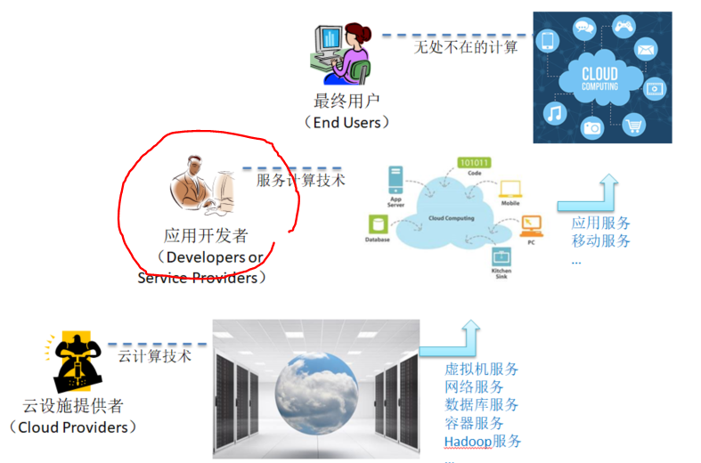

## 服务计算 - 云应用开发方法、技术与架构
{:.no_toc}

* 目录
{:toc}

## 1、概述

云计算技术的飞速发展，越来越多企业借助“云”提供创新服务或改进企业生产力，云服务创新企业不断涌现，形成万亿级别的企业云服务应用开发市场。云提供商、云应用企业大量渴求了解云计算知识，能够在云上快速开发“**高性能、高可靠、高可用、可伸缩**”的企业级原生应用的人才，以满足日益增长的云服务管理、云应用开发与运维的需要。

面向服务是云应用软件的基本特征。云计算平台管理服务、零售在线服务、第三方认证服务、移动应用服务端、在线编程服务、到超算云、IoT云、AI云服务等等，它们通常以 web service 的形式提供。以 [Docker](https://www.docker.com/) 为代表的容器技术出现，正在逐步改变软件的开发过程与开发方法。 pivotal 提出“[云原生应用/cloud-native Apps](https://pivotal.io/cn/cloud-native)” 的概念，逐步将“容器”、“微服务”、“持续集成与交付”、“DevOps”等概念串联起来。 Adam Wiggins 提出 [12 factor App](https://12factor.net/) 企业云应用宣言【[中文](http://www.infoq.com/cn/news/2012/09/12-factor-app)】，并创建了 [Heroku](https://www.heroku.com/) 云应用开发管理平台。Martin Fowler 在 2014 给出了“[微服务](http://martinfowler.com/articles/microservices.html)”架构（microservice archtecture）定义【[中文](http://mp.weixin.qq.com/s?__biz=MjM5MjEwNTEzOQ==&mid=401500724&idx=1&sn=4e42fa2ffcd5732ae044fe6a387a1cc3#rd)】，给出云应用构建的架构方法与准则。

  每种语言都有自己面向服务的技术栈，且在不断完善中。 文本仅关注并使用 go 语言。

## 2、课程的定位与目标

### 2.1 课程的定位

### 2.2 课程目标

* 掌握 go 语言知识，建立面向对象的编程思想，具有初步程序框架开发能力
* 掌握 Restful 服务开发的知识，了解前后端分离开发技术，能够使用CI/CD流程交付一个简单服务项目
* 了解微服务架构，了解容器云如 Docker Swarm、Kebenetes的基本原理，使用容器云部署项目

## 3、课程组织与内容

### 3.1 课程组织

Part I: Golang 基础

> 本部分学习 Go 语言编程相关的基础知识，设计模式，以及命令行程序编程技巧。由于系统工程师的工作环境需要，课程的设定都是Linux操作系统，尽管在Windows下一切都能完美工作。包括内容：Go语言基本语法、函数、结构体与接口，并发、异常处理，面向对象程序编程、工作空间与包。CLI程序开发等。

Part II: Web 服务编程与框架

> Web 服务端的工作原理与程序结构。web 静态文件服务、模板输出、输入路由、表单处理、过滤器框架与设计等 Request 和 Response 相关的处理。 database/sql 包的工作原理、mysql 服务器访问、 基于 entity - dao - service 三层结构层次模型、 sql template 的设计、 xorm 简介。 CI/CD？客户端的编程模型？

Part III: 微服务架构与服务管理

> 讲述微服务架构，以及应用在容器云（Docker Swarm）中的部署

### 3.2 课程内容

| 周/次 | 课程内容 |  课后阅读 与 作业 |
|:--:|  ---- | ---- |
| 1 | 云计算与服务计算 | 阅读：《云计算 概念、技术与架构》   作业：[安装配置你的私有云](ex-install-cloud) |
| 2 | 服务计算与Go语言 | &nbsp; |
| 3 | Go 语言基础 | 作业：[安装 Golang 开发环境](ex-install-go) |

### 3.3 大作业要求

详细见：[大作业指南](ex-homework-project)

## 4、课程其他信息

### 4.1 必备知识

前置或并行学习知识：

* 操作系统
* 计算机网络
* c 或 python 语言
* （自学，大作业团队必须要有一人） 会使用 Vue，React，AngularJS，或其他 JaveScript 前端开发框架

建议后续学习课程：

* 云计算

### 4.2 教材与参考书

参考书：

* Thomas Erl. _Service-Oriented Architecture: Analysis & Design for Services and Microservices_, 2nd Edition. Prentice Hall, 2016
* Kevin Hoffman，《Cloud Native Go：构建基于Go和React的云原生Web应用与微服务》，电子工业出版社，2017

### 4.3 课程支持

* 教师邮箱 panml@mail.sysu.edu.cn
* 支持 QQ 群： 851549217

## 5、作业提交与考核方法

### 5.1 作业提交

Github 和 博客（务必设置分类，以便于检查和批改）

**什么内容可以写博客？**

1. 帮助小白类。系统操作指南、个人经验分享、技术科普。 例如：
    - [在Github上创建Organization](https://chun-ge.github.io/How-to-establish-an-organization-on-Github/)
    - [Vue极简快速入门手册](https://www.jianshu.com/p/b5cb9b30ffd8)
    - [关于golang使用mysql以及docker的一些坑](https://blog.csdn.net/weimumu0515/article/details/78733919)
2. 框架设计类。介绍自己的设计与实现（必须有Github实现链接）。例如：
    - [ORM-Engine](https://github.com/smallGum/service-computing/tree/master/orm-engine)
3. 技术研究类及其他。例如：
    - [云端服务器部署 denyhosts 抵御 ssh brute force 攻击](https://www.zybuluo.com/longj/note/1197554)

### 5.2 考核内容

|项目 | 分数 | 备注 |
| --- |:---:| -- |
| 平时作业 | 40 | 见作业栏 |
| 大作业   | 40 | [大作业指南](homework-project) |
| 博客分享 | 20 | 按博客贡献度。贡献度标准质量+访问量 |

&nbsp;

[Markdown 语法演示页](demo).