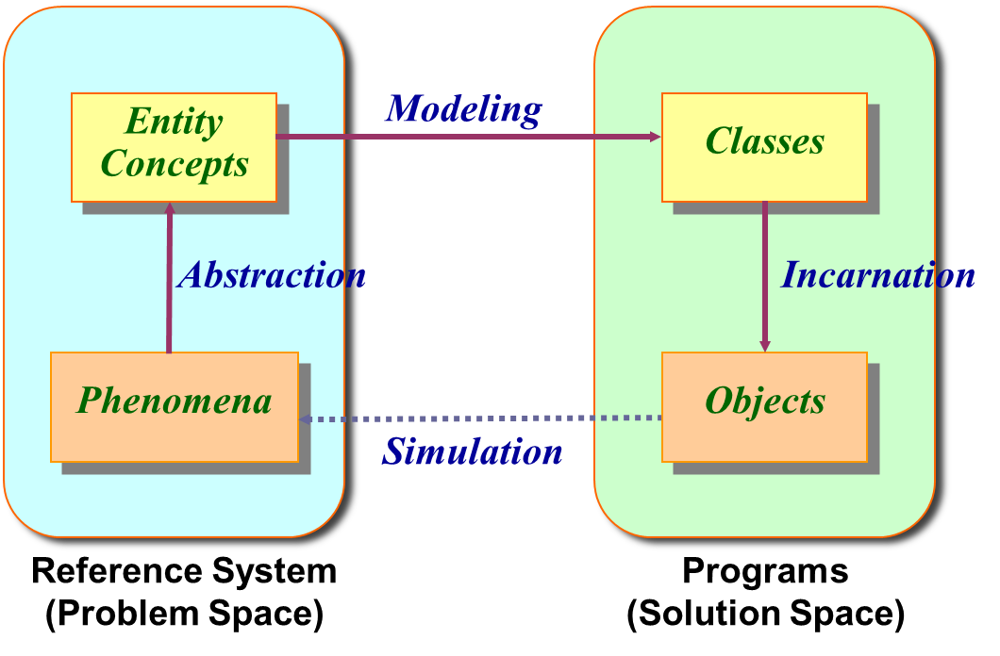
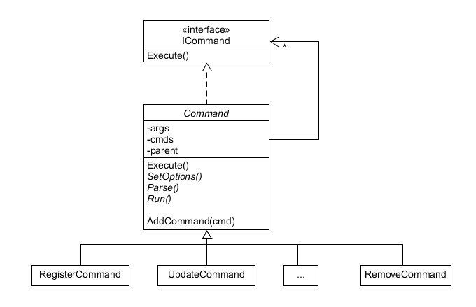

# 面向对象思考与 golang cobra 库实现原理 
{:.no_toc}

* 目录
{:toc}


**golang 不是面向对象的语言** ，在golang中函数是一类成员（[First-class function](https://en.wikipedia.org/wiki/First-class_function)）/[知乎解释](https://www.zhihu.com/question/27460623) 。本文不打算纠结 golang 有哪些面向对象特性，仅关注面向对象的思想如何在 golang 中应用，让我们轻松一些写出类似 [cobra](https://github.com/spf13/cobra) 中 comamnd.go 这样易于使用、可扩展的程序。

> 本文要点：
> 1. 面向对象设计与编程基本概念
> 2. Golang 的与面向对象支持相关的知识
> 3. 用设计模式设计 command.go
>
> 前提条件：
> 1. go tour 练习完成
> 2. 使用 flag 包处理简单的 cli
> 3. 熟悉 C++ 或 Java

## 环境准备

[cobra](https://github.com/spf13/cobra) 是一个构建命令行应用接口的工具，使用 `go get github.com/spf13/cobra`。 使用 cobra 命令创建一个 golang 应用，文件结构

```
main.go
/cmd
    root.go
    register.go
    delete.go
```

其中： register 和 delete 命令支持 `-u --user=name` 参数。

阅读corba文档代码示例和生成的文件，它提供了解耦合良好的程序模块，每个命令拥有自己独立的参数定义和执行逻辑可包装在一个独立的 go 源代码文件中。

**问题： Command 为什么要这样设计？**，其实它一个经典面向对象设计模式使用的技巧！ 

## 1、面向对象设计与编程基本概念

**什么是面向对象？**

> **Everything is an Object.**  
> <div align = right>--- Bruce Eckel 《Thinking Java》</div>

对于普通人，面向对象设计与编程是最常见的选择。多年产业实践证明，面向对象具有具有易于理解、易于复用（reuse）和可扩展（extend）的优势。如果我们把世界的一切用函数来理解，这需要你具备更加优秀的抽象思维能力，特别是数学思维能力。Lisp 等语言的成功，证明了以 λ 演算为基础语言的重要性，它更容易高效编写高品质的程序。同样，用顺序、分支与循环这样结构化方法理解计算，则相对机械一些。

**面向对象的语言？**

以 **对象** 作为基本 **程序结构单位** 的程序设计语言。纯面向对象语言：Smalltalk, Eiffel(埃菲尔)，...，Java。 其中 Java 是最成功的程序设计语言，长期排在 [TIOBE 编程语言指数](https://www.tiobe.com/tiobe-index/)排行榜前二位。随着互联网发展，尽管出现了许多新的语言 Golang, Clojure, Scala，Dart 等更挣钱的语言的竞争，Java 目前稳居排行榜第一位， “存在即真理” 的背后，一定有它的道理。

**什么是对象**

> An object is **the simulation of an entity in a computer**.  
> An object is **an encapsulation of attributes, behaviors and constraints**.  



**面向对象语言的特点**

* 包装 Encapsulation
* 信息隐藏 Information Hiding
* 数据抽象 Data Abstraction
* 继承 Inheritance
* 多态 Polymorphism

通过上述技术，实现了 Reference System -> Design & Programming

**面向对象的设计**

设计对象、接口、以及对象之间的关系，三个元素用于求解问题。

**设计模式**

常见应用场景的涉及的对象、对象外部特征、及其之间关系，以及典型代码。例如：

* 单例（Singleton）模式
* 命令（Command） 模式
* 模板方法（Template methods）模式
* 组合（Composite）模式
* ...

## 2、Golang 的语言知识与折中（trade off）

函数虽然高雅，但不是一般人容易理解与接受，并写出高品质的程序。运用面向对象的思想在非 OOP 语言中编程，就是必须掌握的技能了。
首先，我们复习一些语言知识，同时讨论 go 语言设计与折中的选择。

### 2.1 Go 语言的基本元素

* 数据与数据类型 type
* 函数 func
* 包 package

深入理解 [Nicklaus Wirth](http://www.admin5.com/article/20061113/6304.shtml) **算法+数据结构=程序** 这句话永远不错。

Go的理念： 简单、简单、简单  （没考证 ！？对吗？）

* 数据就是数据，是不可变的。例如：
    * Student 作为数据就是 Student，不是 Person
    * Student 作为对象是 Person
* 函数是一种类型，值是 First-Class 的
    * 函数类型 = 函数签名 (什么是函数签名？)

Go 是静态类型化的。**每个变量都有一个静态类型，也就是说，在编译的时候变量的类型就被很精确地确定下来。**

### 2.2 Go 的包装与隐藏

**包导出类型与数据**

go 的包装单位是 package。 将包中数据或类型的 **第一个字母大写** ，就导出该包中的内容。

**包命名**

包的全名称是工作区 src 中目录结构的路径（除了语言内置包），短名称就是最后目录名。为了便于编程，包可以使用 **别名(alias)**
例如，我们不喜欢 go 内置包 `flag` 处理参数的风格，我们喜欢 POSIX 风格命令行，怎么办？

```go
import (
  flag "github.com/spf13/pflag"
)
```

搞定啦！你命令行程序不需要修改其他地方了。

*实践*： 将 delete.go 程序拖到 main.go 所在的目录，运行程序 `go run main.go help` 结果是？

**go 程序文件**

包由一些 go 文件构成。一个包中不能出现相同的类型或变量，包括函数名。它不似 java 那样一个文件对应一个对象类型，你必须机智的记住 go 文件中定义的包变量和类型。你可能需要编写 `vars.go` 或 `types.go` 来集中管理它们，但一个类型、一个变量一个文件也是最佳实践之一。

**init() 和 main() 函数**

每个 go 文件可以有一个特殊的函数 `init()`， 它是包中唯一可以重名的函数。包初始化代码必须在 init() 中。

它们的执行顺序是？ 参见 [go/golang main() init()方法的调用](https://studygolang.com/articles/5036)

### 2.3 数据抽象

*基本类型不用解释！*

Java 数据抽象仅一类： Object， 它对外呈现一些 interface，对象之间通过消息协作。

Go 要复杂一些：

* struct
* func
* interface
* specials: chan

**methods**

go 的方法似乎很有特色，让我们操作数据时有了“面向对象”的感觉。其实，在上世纪面向对象语言[Eiffel(埃菲尔)](https://en.wikipedia.org/wiki/Eiffel_(programming_language)) （第二个）就有了啊。感兴趣去[看一看](https://en.wikipedia.org/wiki/Eiffel_(programming_language)#Operator_and_bracket_syntax.2C_assigner_commands)。

* var type 语法
* eiffelThreads vs goroutine 并发
* static typing
* ...

go-method 的确是值得夸赞的创新，它与接口实现了无缝对接。它通过 `receiver argument` 概念，让不同类型的 operator 具有了相同的函数签名。而一组函数签名相同的操作与接口一致，则实现了接口与数据类型的隐式静态绑定。

```go
type Vertex struct {
	X, Y float64
}

func (v Vertex) Abs() float64 {
	return math.Sqrt(v.X*v.X + v.Y*v.Y)
}

func Abs(v Vertex) float64 {
	return math.Sqrt(v.X*v.X + v.Y*v.Y)
}

func main() {
	v := Vertex{3, 4}
	fmt.Println(v.Abs(), Abs(v))
}
```

在以上代码中，`函数 Abs` 与 `方法 Abs` 语义是一样的，方法可以被认为是“语法糖”。但对于编译，Vertex 类型的数据可 **静态** 推导到接口类型

```go
type Abser interface {
	Abs() float64
}
```

**构造方法**

为了实现 struct 的构造，golang 提供了一些编程约定（convention），例如：

* 提供 `NewVertex(v Vertex) *Vertex` 这样的函数
* 提供 `(v *Vertex) New()` 这样的方法


**接口抽象**

这种静态绑定，为 go 处理多种数据带来了便利。因为任何类型数据都一个匹配到空接口 `interface{}`

```go
// Println formats using the default formats for its operands and writes to standard output.
// Spaces are always added between operands and a newline is appended.
// It returns the number of bytes written and any write error encountered.
func Println(a ...interface{}) (n int, err error) {
	return Fprintln(os.Stdout, a...)
}
```

这样 Println 就可以打印所有类型的数据。关键是 fmt 如何从 `interface{}` 得到原数据和 `Stringer` 接口

```go
// Stringer is implemented by any value that has a String method,
// which defines the ``native'' format for that value.
// The String method is used to print values passed as an operand
// to any format that accepts a string or to an unformatted printer
// such as Print.
type Stringer interface {
	String() string
}
```

它与 Go 内部实现机制，通过反射技术 [Go语言中反射包的实现原理](https://golang.top/articles/2157) 可见一般。

阅读 go 的语言库源代码，如 fmt.Println。这是最快、最强大的学习方法！

### 2.4 匿名组合 pk “继承”

提到继承，总有许多争议。例如，继承的副作用？

* 继承是白盒的，这导致一个类继承了基类，基类与子类必须都进行完整的测试。
* 多重继承的复杂性。
* 继承与组合。哪些条件不能使用继承？例如：
    * 班长一般不能继承于学生
    * 方形不能继承于长方形

Golang 不支持继承，但很好的支持组合，因为“**组合优于继承**”[知乎的一些讨论](https://www.zhihu.com/question/21862257)（萧萧是正确的）。但提供了类似“继承”的语法。

例如：

```go
type Vertex struct {
	X, Y float64
}

type Circle struct {
  Vertex
  R float64
}

type Cylinder struct {
  Circle
  H float64
}

func ToCircle(u *Vertex, r *Cylinder) *Circle {
	if &r.Vertex == u {
		return &r.Circle
	}
	return nil
}

func main() {
	cy := Cylinder{Circle{}, 10}
	//cy := Cylinder{X: 3} 编译错误
	cy.X = 3
	fmt.Println(cy)
	v := cy.Vertex
	v.Y = 4
	fmt.Println(cy, v) //cy = ?
	u := &(cy.Vertex)
	u.Y = 4
	//c := Circle(u) 编译错误
	fmt.Println(cy, u) //cy = ?
	c := ToCircle(u, &cy)
	c.R = 5
	fmt.Println(cy, c, c.Vertex) //cy = ?
}
```

上述程序很有趣，cy 是 Cylinder 类型的数据。

* `Cylinder{X: 3}` 为什么错误， `cy.X = 3` 为什么正确，这语法玩的溜！
* `v := cy.Vertex` v 是值，不是指针。 似乎是 deeply clone ?
* 别指望面向对象哪种向上类型转换（UpCasting），注意用指针哦（操）！
* 别指望面向对象哪种向下类型转换（DownCasting），自己手工实现。
* `c := ToCircle(u, &cy)` 改为 `c := ToCircle(&v, &cy)` 结果是？

没有面向对象，以前系统运行时（runtime）做的一切，都需要自己亲手实现。
不过习惯静态类型就好了，唯一的麻烦就是 值与指针从变量名太难区分！

*convention*：用大写 `P` 作为变量名后缀表示指针？？

### 2.5 多态

**什么是多态？**

> Generally speaking, a name has multiple meanings.   
> * Names of data:  association between variables and types.
> * Names of operations:  association between method names and bodies.

为什么要有多态，面向对象的方法的说法是便于 **重用** 和 **扩展**。

**如何实现多态？**

> * Data:  Implicit Type Conversion + Explicit Type Conversion
> * Operations:  Overloading  + Dynamic Binding

**实现手段：Binding**

> Static Binding
> * Determine the method body associated with List.search(...) at compile-time
> * Commonly used in traditional languages such as C, Pascal, Algol 68, etc.

> Dynamic Binding
> * Determine the associated body of List.search(...) at run-time
> * C++:  Static binding by default. Support dynamic binding.
> * Java:  Dynamic binding by default. Support static binding.

**go 语言仅支持静态绑定！！！**

编译多态能做什么？

- Compiler-Time Polymorphism
    - Overloading
        - Method Overloading
        - Operators Overloading
            - System Defined
            - User Defined
    - Generics

go 编译器做了什么？

* 通过方法和函数签名实现多态
* 通过接口实现多态

Go中不允许不同类型的赋值，折中的解决方案就是 interface 类型大招！ **interface值** 是（value,type）元组。利用接口可实现：

* 静态隐式支持接口类型 UpCasting。 interface{} 就是万能接口
* 接口查询支持 DownCasting 到 value 或 接口。

**接口 UpCasting**

```go
// Shaper is Inteface
type Shaper interface {
	Area() float64
}

type Square struct {
	L float64
}

func (s Square) Area() float64 {
	return s.L * s.L
}

type Rect struct {
	A, B float64
}

func (s *Rect) Area() float64 {
	return s.A * s.B
}

type A4Paper struct {
	Rect
	W int
}

// A4Paper 没有实现接口

func main() {
	//we can assign the variable of Square to variable of Shaper(interface)
	sShaper := Shaper(Square{4.0})
	rShaper := Shaper(&A4Paper{Rect{4, 5}, 80})
	fmt.Println(sShaper.Area(), rShaper.Area())
}
```

接口的 UpCasting 可以解决许多问题。例如：`sShaper := Shaper(Square{4.0})` 是编译完成的隐式变换，接口值（Square{4.0}，Square）赋值给了 sShaper, 确保了运行期调用 Square.Area()，并由 Square{4.0} 接收。这是简单而安全的实现。

**接口 DownCasting**

如何实现函数 `func PrintShapes(a ...interface{})` 函数打印输入数据的面积呢？ 关键在于 `interface{}` DownCasting `Shaper`。
Golang 提供了接口查询这个特殊的语法 `intefaceValue.(T)` 称为 *type assertion*

```go
func PrintShapes(a ...interface{}) {
	for _, iface := range a {
		//type assertion to test value implement a interface
		//type assertion is only applied on interface, so we cast the s to empty interface
		if v, ok := iface.(Shaper); ok {
			fmt.Println(v.Area())
		}
	}
}
```
这意味类型断言 `t,ok := intefaceValue.(T)` 中 `t` 的类型是编译期可以决定，但 `inteface 值的 type` 能否 upcasting 转为 `T` 则是运行期完成的。通过运行期查类型定义表，间接实现了接口 DownCasting 的任务。

在 main 中调用 `PrintShapes(Square{4}, 18, &A4Paper{Rect{4, 5}, 80})` 我们看到了期望的结果 `16 20`。

请问：`if v, ok := iface.(Shaper);` 中 `Shaper` 修改为 `Square`，`A4Paper`，`*A4Paper`，`Rect`，`*Rect` 各输出什么？

## 3、设计模式应用 - 以 golang cobra 为案例

有了匿名组合，接口类型的上下Casting，函数（签名）类型，我们可以在不使用反射的条件下，实现面向对象的设计。即面向对象的设计思想可用于 golang 编程实践。

本节的任务是设计并用 golang 实现类似 Cobra 的 Command 。

* cli 涉及的设计模式
* command.go 设计原理

### 3.1 单实例（Singleton）模式

单实例模式是面向对象设计最常见的模式。在命令行应用中，`args []String` 就是一个全局的，唯一的变量。单实例模式使用场景：

* 提供全局唯一静态的对象访问
* 屏蔽复杂的初始化或对象产生逻辑

对于 golang ，最简单就是“饿汉方式”方法，定义一个包变量，例如：

```go
var Args = os.Args

func init() {
	fmt.Println("init logic here...", Args)
}
```

另一种就是使用时创建，称为“懒汉方式”，是利用函数输出数据的指针。例如：

```go
var args *[]string
var mu sync.Mutex

// GetArgs *
func GetArgs() *[]string {
	if args == nil {
		mu.Lock()
		defer mu.Unlock()
		if args == nil {
			args = &os.Args
			fmt.Println("init logic here...", *args)
		}
	}
	return args
}

func init() {
	fmt.Println("use cmd.GetArgs() anywhere...", GetArgs())
}
```

双重锁，解决了并发效率问题

### 3.2 命令（Command）模式

为了解决命令者与执行者之间的分离，通常需要接口抽象，执行者实现这个这个接口，命令者使用这个简单的接口，而不需要知道实现。

```go
type Commander interface {
	Execute() error
}
```

这样，定义操作 `Execute() error` 的类型，都可以使用这个接口了。

### 3.3 模板方法（Template methods）模式

为了执行一个命令，我们并不知道一个命令的具体参数，如何执行。 Java 典型的设计套路是：

* 定义接口
* 定义抽象类
* 定义实现类

结合 cli 程序特点，命令解析分为三个步骤：定义参数、解析命令、执行命令。模板方法就用上了，详细参考：[设计模式之美：Template Method（模板方法）](http://www.cnblogs.com/gaochundong/p/design_pattern_template_method.html)，关键在于：

* 抽象操作（Primitive Operation）(must be overridden)
* 钩子操作（Hook Operation）(may be overridden)，通常提供默认实现。

**定义抽象数据**

落实到 command.go 代码：

```go
// Command .
type Command struct {
	// Use is the one-line usage message.
	Use string
	// Short is the short description shown in the 'help' output.
	Short string
	// Long is the long message shown in the 'help <this-command>' output.
	Long string
	// SetOptions:
	SetOptions func(c *Command) error
	// Parse:
	Parse func(c *Command) error
	// Run: Typically the actual work function. Most commands will only implement this.
	Run func(cmd *Command, args []string)
}

// Execute .
func (c *Command) Execute() error {
	if ok := c.SetOptions(c); ok != nil {
		fmt.Println("Error in SetOptions!")
		return ok
	}
	if ok := c.Parse(c); ok != nil {
		fmt.Println("Error in Parsing!")
		return ok
	}
	c.Run(c, Args)
	return nil
}
```

上述代码的要点：

* 定义了三个回调函数，也就是钩子操作。没有虚方法也是有办法的！
* 定义了模板方法 `Execute()`

**定义实现**

落实到 main.go 代码：

```go
func main() {
	//cmd.Execute()
	var RootCmd = &cmd.Command{
		Use:   "test",
		Short: "A brief description of your application",
		Long:  "A longer description",
	}
	RootCmd.SetOptions = func(c *cmd.Command) error {
		fmt.Println("Set Options here")
		return nil
	}
	RootCmd.Parse = func(c *cmd.Command) error {
		fmt.Println("Parse here")
		return nil
	}
	RootCmd.Run = func(c *cmd.Command, a []string) {
		fmt.Println("Do comamnd")
	}
	RootCmd.Execute()
}
```

**运行成果**

`go run main.go -uPan`

结果是：

```
Set Options here
Parse here
Do comamnd
```

**完善程序**

command.go 添加方法 和 局部变量

```go
// Flags returns the complete FlagSet that applies
// to this command (local and persistent declared here and by all parents).
func (c *Command) Flags() *flag.FlagSet {
	if c.flags == nil {
		c.flags = flag.NewFlagSet(c.Use, flag.ContinueOnError)
	}
	return c.flags
}
```

修改 main.go

```go
func main() {
	//cmd.Execute()
	var RootCmd = &cmd.Command{
		Use:   "test",
		Short: "A brief description of your application",
		Long:  "A longer description",
	}
	RootCmd.SetOptions = func(c *cmd.Command) error {
		fmt.Println("Set Options here")
		c.Flags().StringP("user", "u", "Anonymous", "Help message for username")
		return nil
	}
	RootCmd.Parse = func(c *cmd.Command) error {
		fmt.Println("Parse here")
		c.Flags().Parse(cmd.Args)
		return nil
	}
	RootCmd.Run = func(c *cmd.Command, a []string) {
		fmt.Println("Do comamnd")
		username, _ := c.Flags().GetString("user")
		fmt.Println("myCommand called by " + username)
	}
	RootCmd.Execute()
}
```

现在你可以方便的实现简单命令了哦！！！

### 3.4 组合（Composite）模式

组合模式的意图：

* 将对象组合成树形结构以表示 “部分-整体” 的层次结构。
* Composite 使得用户对于单个对象和组合对象的使用具有一致性。

具体参考：[设计模式之美：Composite（组合）](http://www.cnblogs.com/gaochundong/p/design_pattern_composite.html)

代码 **实现要点** ：

* command 添加 AddCommand。参考 cobra 的实现
* Execute() 方法有 bug 。客户不写钩子函数没有处理
* 需要写一个标准的 Parse 钩子实现
    * 如果不是根命令，当前 args 是 `c.args := parent.args[1:]`
    * 如果没有子命令，执行 `c.Flags().Parse(c.args)`
    * 有子命令，没匹配上 `c.args[]` 显示 help
    * 匹配子命令成功，执行 `c.Execute()`

没有写实现，就交给你完成了。 cobra 主要功能 OK 了。

## 4、小结

与 c 相比，golang 中使用面向对象的设计思想编程是不错的。语言中编译静态能做的都做的很好，类型与其接收的方法（操作）也让你有面向对象编程的感觉。除了接口，type是静态的，不能相互赋值（支持基本类型隐式转换），但接口支持隐式静态泛化实现upcasting，接口断言支持动态downcasting。因此，可以较好实现面向对象思想设计，但是运行时动态必须你自己实现。例如：没有所谓虚方法，你需要通过回调函数实现，并仔细维护回调链，这需要你有更强大的程序设计水平。总之，golang 入门容易，但达到实用水平比较难。

命令行处理有标准的面向对象设计模型，它与 cobra 的 golang 设计是一致的。 本文 UML 设计如图所示：



如果你理解并完成了上述设计，恭喜你！可以称为 golang 专业一段了。
