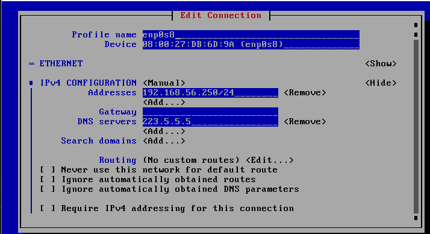

## 一、制作 centos 基础 VirtualBox 虚拟机
{:.no_toc}

安装一次虚拟机需要较长的时间，安装一个 base VM 然后新 VM 建立在其上是一件省空间（对用256G以内笔记本的同学意义非凡）、省时间的事情。

* 目录
{:toc}

### 1、安装 minimum 系统

进入 centos 官网，下载 Minimum ISO 最新版本（7.6.1810），选择选阿里云镜像服务器（最快）

在主机上安装 VirtualBox，并用 VirtualBox 全局工具创建主机虚拟网络网卡（Host Only Ethernet Adapter ），设置 ip 地址如： 192.168.56.1/24

创建虚拟机 centos-base-250，硬盘选择 30G ，其他都使用默认设置。启动，Minimum 安装系统。

按向导指引设置：

* 语言：汉语 - 简体中文
* 系统 - 安装位置：进去看一下，按完成
* 系统 - 网络：打开网卡 enp0s3 , 主机名：centos-base-250 
* 配置 - root 密码

安装完成，重启虚拟机。测试：`ping 163.com` 网络正常即可！ 关机

### 2、必要配置

#### 2.1 设置网卡

* VirtualBox 配置 centos-base-250 虚拟机网络，启用添加网卡2。 
    - 连接方式： 仅主机（Host-Only）网络
    - 界面名称：选择前面创建的网络

重新启动虚拟机

* 使用 `nmtui` 命令管理网卡和主机名
    - edit a connection 选新的网卡
    - 设置 profile name ： enp0s8
    - 设置 IPv4 Configuration : Manual
    - 添加 Address ： 192.168.56.250/24
    - 添加 DNS Server : 223.5.5.5
    - activate a connection 选新网卡
    - 先 deactivate 然后在 activate
    - set hostname 
    - 设置 主机名
    - OK 退出

如图所示：




* 检查
    - `ping 192.168.56.1`
    - `ping 163.com`

Linux 网路配置基础知识 Centos7 ：[CONFIGURING NETWORK INTERFACES](http://landoflinux.com/linux_rhel_centos_network_configuration.html)

#### 2.2 设置 SSH

如果 windows 主机需要安装 Git Bash 作为控制台

按 [ssh 设置](2-ssh) 指南，先登陆 192.168.56.250，退出，再将公钥复制到虚拟机

这时你可以免密钥登陆它。

#### 2.3 配置国内 yum 源

先 `yum install -y wget` 

如果系统已选择国内的源（如以下），请跳过后面内容。

```
[root@contos-base-250 ~]# yum install -y wget
已加载插件：fastestmirror
Loading mirror speeds from cached hostfile
 * base: mirrors.aliyun.com
 * extras: mirrors.aliyun.com
 * updates: mirrors.aliyun.com

```

否则：搜索 `设置centos 阿里云源` 就看到无数博客。按人家提供的步骤，将命令粘贴到控制台。

#### 2.4 更新系统

升级到最新系统，这几乎是安装新软件的第一步！

```
# yum update
```

然后关机

```
# shutdown -h now
```
