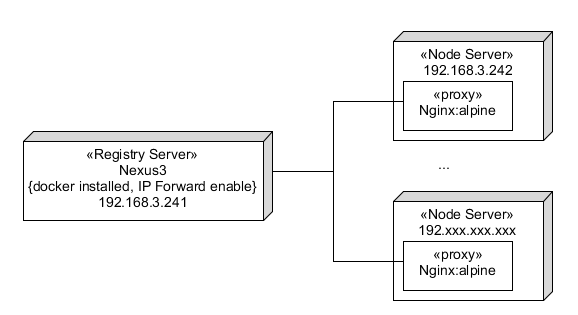
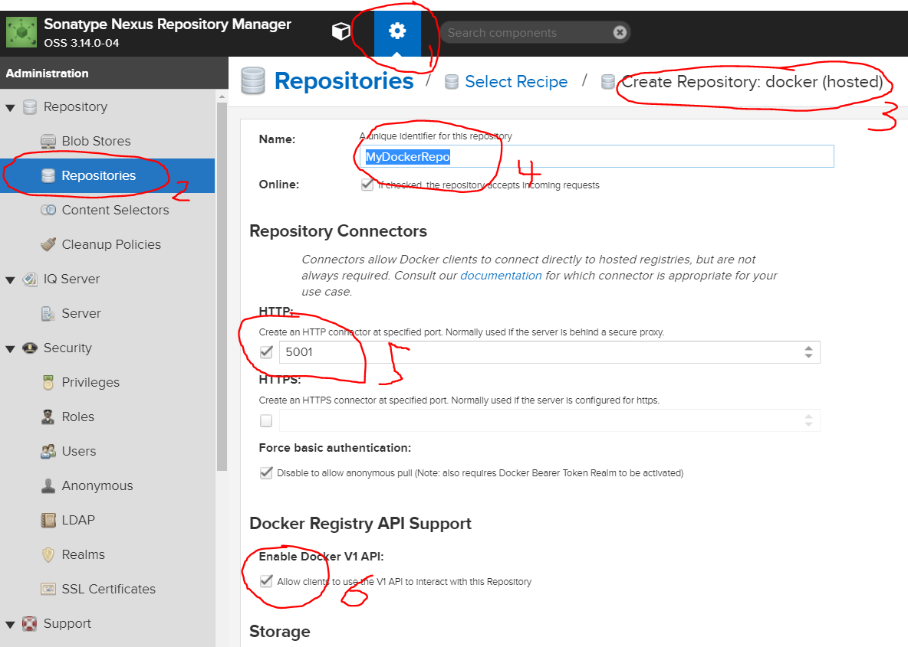
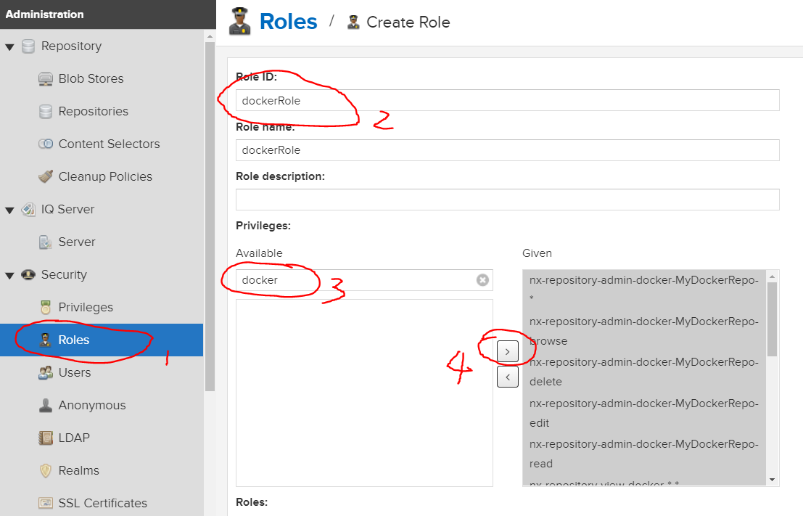
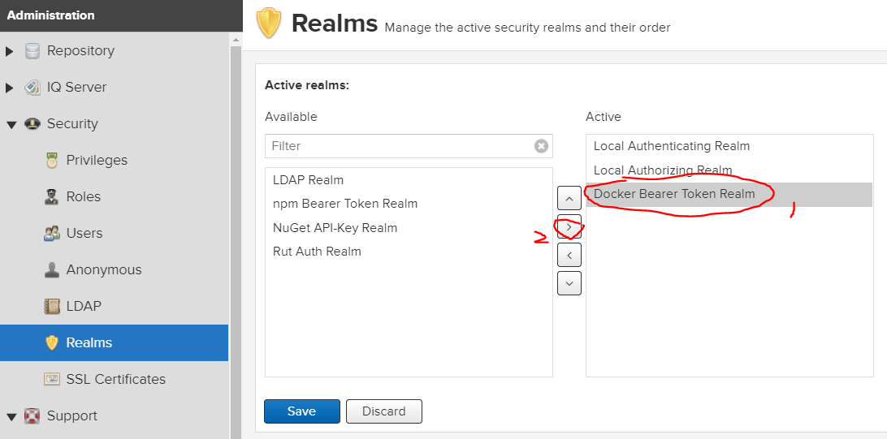
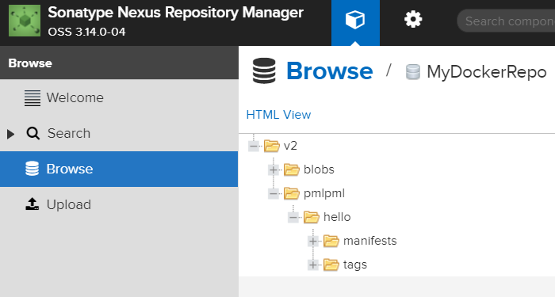

## 服务计算 - 为集群提供本地 Docker Registry 镜像仓库
{:.no_toc}

在局域网搭建或使用容器集群，如 Kubernetes 等，没有本地镜像仓库几乎是不可想象。然而，docker 仅支持 Https 访问仓库 API。这就需要为 Registry 提供域名，并提供 X.509 格式 ca 证书。无论自签证书或免费证书对于实验环境都太复杂。

## 原理

这里，我们使用 nexus3 搭建 Docker Registry 服务器（有企业级的管理界面），在集群每台机器上使用 Nginx 代理作为代理，利用 docker 引擎对 127.0.0.0 可使用 http 协议访问 Registry 的特点，使得每台机器都可以访问 localhost:5001 仓库。

**1、验证**

```
# docker info
...
Insecure Registries:
 127.0.0.0/8
```

显示不安全（用HTTP协议访问）仓库的网段。修改这个配置也是比较现实的啊，但不同 docker 版本的配置修改 ... ...??（不一定能成功哦）

**2、部署结构**

准备如图环境，虚拟机/物理机都可以



注意：每台机器都安装了 docker 引擎，且使用 `docker info` **不能出现** `WARNING: bridge-nf-call-iptables is disabled` 

解决问题办法：[启用 IP-Forward](http://www.cnblogs.com/jackluo/p/5422243.html)

## 1、安装 nexus3

1、创建目录 `nexus-data`

注意：如果你是 root 用户，请使用 `chmod 777 nexus-data`

2、使用 nexus3 镜像启动（约 3-6 分钟，请耐心等待，Java Web都这样）

```
docker run -d -p 8081:8081 -p 5001:5001 --name nexus -v $PWD/nexus-data:/nexus-data sonatype/nexus3
```

**注意：务必上官网，查看最新变化**，https://hub.docker.com/r/sonatype/nexus3/

3、使用 `docker logs nexus` 了解启动情况，直到看到

```
-------------------------------------------------

Started Sonatype Nexus OSS 3.14.0-04

-------------------------------------------------

```

4、使用浏览器访问管理界面，

例如：http://192.168.3.241:8081/

## 2、配置

**1、登陆**

请使用默认管理员 admin 密码 admin123 登陆。 选择配置

**2、添加一个 docker(hosted) 仓库**

按下图顺序选择菜单，填写创建仓库的选项



最后，点击 Save 按钮

可以使用 `curl http://localhost:5001` 测试仓库服务端口是否启动

**3、创建 Roles**

按下图顺序选择菜单，填写创建仓库的选项



最后，点击 Create 按钮

**4、docker 访问授权模式**

按下图顺序选择菜单，将 Docker Bearer Token Realm 激活



最后，点击 Save 按钮

**5、创建docker用户**

按下图顺序选择菜单，将 DockerRole 授予用户


最后，点击 Create Local User 按钮，配置完成

## 3、 本地用户上传镜像

**1、Registry主机用刚才注册用户登陆**  

```
[root@centos-registry-241 ~]# docker login localhost:5001
Username (pmlpml): pmlpml
Password:
Login Succeeded
[root@centos-registry-241 ~]#

```

**2、上传镜像**

先 `docker pull hello-world` 

例如：

```
[root@centos-registry-241 ~]# docker tag hello-world localhost:5001/pmlpml/hello:1
[root@centos-registry-241 ~]# docker push localhost:5001/pmlpml/hello:1
The push refers to a repository [localhost:5001/pmlpml/hello]
428c97da766c: Pushed
1: digest: sha256:7d6fb7e5e7a74a4309cc436f6d11c29a96cbf27a4a8cb45a50cb0a326dc32fe8 size: 524
```

在浏览器查看仓库内容：



## 4、建立本地 proxy 代理

**1、下载 Nginx**

```
$ docker pull nginx.alpine
```

docker hub 官方[镜像说明](https://hub.docker.com/_/nginx/)

**2、 创建转发代理**

创建目录 `nginx/conf.d`

创建配置文件 `nginx/conf.d/default.conf` 具体内容

```
server {
    listen       80;
    server_name  localhost;

    location / {
        proxy_pass http://192.168.3.241:5001;
        client_max_body_size 1000m;
    }
}
```
启动代理：

```
docker run --name nginx-proxy --restart always -v $PWD/nginx/conf.d:/etc/nginx/conf.d:ro -p 5001:80 -d nginx:alpine
```

测试  `curl http://localhost:5001`  应看到 Registry 服务器响应

在线我们在机器上可以使用本地仓库操作了！例如：

```
~]# docker login localhost:5001
...
~]# docker tag rancher/rancher-agent:v2.1.3 localhost:5001/rancher/rancher-agent:v2.1.3
~]# docker push localhost:5001/rancher/rancher-agent:v2.1.3
...
```


